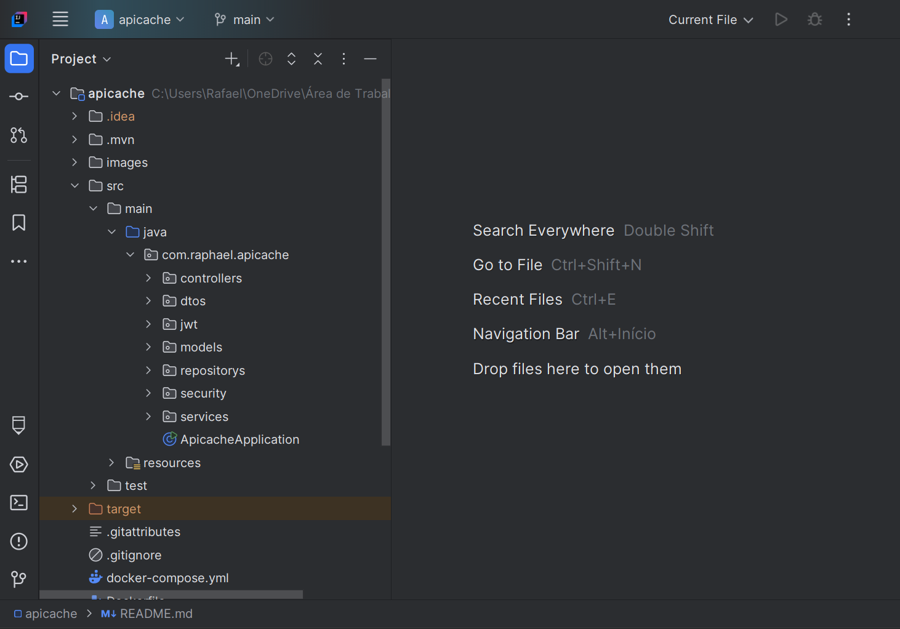
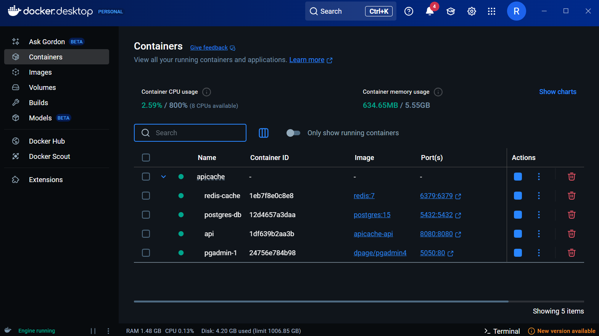
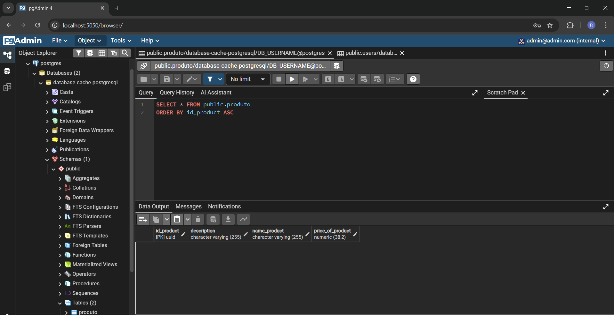

# API de Produtos com Cache, Segurança e Docker

Projeto backend desenvolvido com foco em aprendizado prático e aplicação de tecnologias modernas utilizadas no mercado.

---

## Sobre o Projeto

Esta API foi desenvolvida com o objetivo de consolidar conhecimentos em:

* Containerização com Docker
* Orquestração com Docker Compose
* Cache com Redis
* Segurança com Spring Security
* Integração com PostgreSQL

A aplicação simula um sistema simples de gerenciamento de produtos, com foco em performance, segurança e organização profissional.

---

## Tecnologias Utilizadas

* Java 21
* Spring Boot
* Spring Security
* Spring Data JPA
* PostgreSQL
* Redis
* Docker
* Docker Compose
* PgAdmin

---

## Arquitetura

O projeto segue uma arquitetura em camadas:

* Controller → Entrada de requisições
* Service → Regras de negócio
* Repository → Acesso ao banco de dados

Além disso, foi implementado:

* Cache com Redis para otimizar consultas
* Autenticação com Spring Security

---

## Ambiente com Docker

O projeto sobe automaticamente os seguintes serviços:

* PostgreSQL
* PgAdmin
* Redis
* Aplicação Spring Boot

### 📦 docker-compose.yml

```yaml
version: '3.8'

services:

  api:
    build: .
    container_name: api
    ports:
      - "8080:8080"
    depends_on:
      - postgres
      - redis
    environment:
      SPRING_DATASOURCE_URL: jdbc:postgresql://postgres:5432/database-cache-postgresql
      SPRING_DATASOURCE_USERNAME: DB_USERNAME
      SPRING_DATASOURCE_PASSWORD: DB_PASSWORD
      SPRING_REDIS_HOST: redis
      SPRING_REDIS_PORT: 6379

  pgadmin:
    image: dpage/pgadmin4
    environment:
      PGADMIN_DEFAULT_EMAIL: admin@admin.com
      PGADMIN_DEFAULT_PASSWORD: admin
    ports:
      - "5050:80"
    volumes:
      - pgadmin_data:/var/lib/pgadmin
    restart: always
    depends_on:
      - postgres

  postgres:
    image: postgres:15
    container_name: postgres-db
    restart: always
    environment:
      POSTGRES_DB: database-cache-postgresql
      POSTGRES_USER: DB_USERNAME
      POSTGRES_PASSWORD: DB_PASSWORD
    ports:
      - "5432:5432"
    volumes:
      - postgres_data:/var/lib/postgres/data

  redis:
    image: redis:7
    container_name: redis-cache
    restart: always
    ports:
      - "6379:6379"

volumes:
  postgres_data:
  pgadmin_data:
```

---

## Segurança

A API utiliza Spring Security para autenticação.

### Funcionalidades:

* Login com usuário e senha
* Proteção de rotas
* Configuração personalizada de autenticação

---

## Cache com Redis

Foi implementado cache para melhorar a performance nas consultas de produtos.

### Benefícios:

* Redução de carga no banco de dados
* Respostas mais rápidas

---

##  Endpoints Principais

| Método | Endpoint              | Descrição               |
|--------|-----------------------|-------------------------|
| GET    | /api/v1/produto       | Lista todos os produtos |
| POST   | /api/v1/produto       | Cria um produto         |
| GET    | /api/v1/produto/{id}  | Busca produto por ID    |
| DELETE | /api/v1/produto/{id}  | Deleta um produto       |
| PUT    | /api/v1/produto/{id}  | Atualiza um produto     |
| POST   | /api/v1/auth/login    | Autêntica um usuário    |
| POST   | /api/v1/auth/register | Registra um usuário     |

---

## Como Rodar o Projeto

### Pré-requisitos

* Docker
* Docker Compose

### Passos

```bash
# Clone o repositório
git clone https://github.com/Raphael-Willian/spring-api-cache-with-redis-and-docker.git

# Acesse a pasta
cd apicache

# Suba os containers
docker-compose up -d
```

---

## Imagens do Projeto

### Arquitetura



### Containers Rodando



### PgAdmin



---

## Aprendizados

Durante o desenvolvimento deste projeto, foram consolidados conhecimentos importantes como:

* Configuração de múltiplos serviços com Docker Compose
* Integração entre Redis e Spring Boot
* Estruturação de autenticação com Spring Security
* Boas práticas de organização de código backend

---

## Próximos Passos

* Implementar testes automatizados
* Adicionar documentação com Swagger
* Melhorar estratégia de cache
* Adicionar mensageria (RabbitMQ ou Kafka)

---

## Contribuição

Sinta-se à vontade para contribuir com melhorias!

---

## Contato

* LinkedIn: www.linkedin.com/in/raphael-willian-1a0657265
* Email: [raphaelwillian.cardososilva@gmail.com](mailto:raphaelwillian.cardososilva@gmail.com)

---

# ⭐ Se esse projeto te ajudou, deixe uma estrela!
